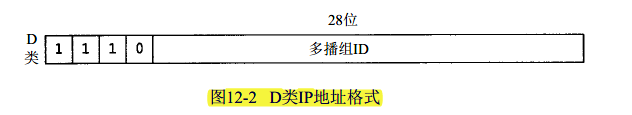

## 组播地址:
   组播报文的目的地址使用D类IP地址
   
1. 组播组可以是永久的也可以是临时的。组播组地址中，有一部分由官方分配的，称为永久组播组。永久组播组保持不变的是它的ip地址，组中的成员构成可以发生变化。永久组播组中成员的数量都可以是任意的，甚至可以为零。那些没有保留下来供永久组播组使用的ip组播地址，可以被临时组播组利用。
2. 224.0.0.0～224.0.0.255为预留的组播地址（永久组地址），地址224.0.0.0保留不做分配，其它地址供路由协议使用；
3. 224.0.1.0～224.0.1.255是公用组播地址，可以用于Internet；
4. 224.0.2.0～238.255.255.255为用户可用的组播地址（临时组地址），全网范围内有效；
5. 239.0.0.0～239.255.255.255为本地管理组播地址，仅在特定的本地范围内有效。

## 组播的原理：
   组播首先由一个用户申请一个组播组，这个组播组被维护在路由器中，其他用户申请加入组播组，这样当一个用户向组内发送消息时，路由器将消息转发给组内的所有成员。如果申请加入的组不在本级路由中，如果路由器和交换机允许组播协议通过，路由器将申请加入的操作向上级路由提交。广域网通信要经过多级路由器和交换机，几乎所有的网络设备都默认阻止组播协议通过(只允许本网段内，不向上级提交)，这使得广域网上实现组播有一定局限。
UDP组播的基本步骤
1. 建立socket
2. socket和端口绑定
3. 加入一个组播组
4. 通过sendto / recvfrom进行数据的收发
5. 关闭socket
